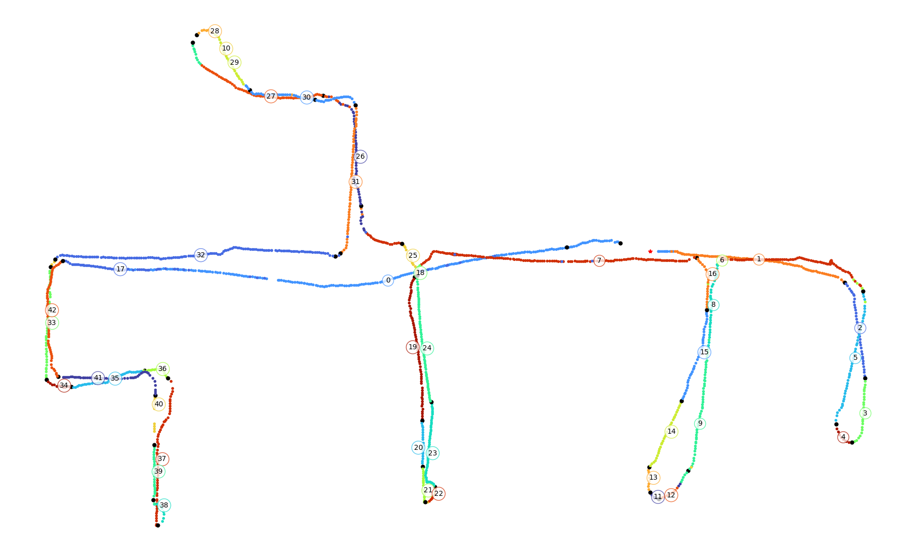

# Topological Maps with Appearance Graph
This repository corresponds to the work entitled 'Creation of Topological Maps by Visual Appearance by Cutting Graphs. Applications to the Recognition of Previously Visited Places' as a Bachelor's Thesis.

**Authors:** Ángel Montejo Quesada and [Javier Gonzalez-Jimenez](https://mapir.isa.uma.es/mapirwebsite/?p=1536)

## Code explanation
This repository implements a method for creating topological maps for Visual Place Recognition based on appearance. It is founded on the creation and segmentation of an Appearance Graph.

**-AppearanceGraph_Construction:** This code implements the computation of the co-visibility matrix and similarity matrix from a given Appearance Map, which leads to the construction of the adjacency matrix for the Appearance Graph.

**-AppearanceGraph_NormalizedCut:** This code implements the recursive bipartition of the Appearance Graph using the Normalized Cut method, resulting in a topology of places for the original Appearance Map.

**-Covisibility_evaluation:** This code is used to evaluate the creation of the Appearance Graph, focusing on the computation of the co-visibility matrix and studying the involved parameter. For this evaluation, a controlled dataset is needed where the actual co-visibility images are known. This code concludes the optimum value for the parameter in the co-visibility measure.

**-VisualPlaceRecognition_EvaluationTools:** This code implements a Visual Place Recognition system, along with different tools to evaluate the Normalized Cut of the Appearance Graph.

**-CutGraph_evaluation:** This code uses the tools implemented in 'VisualPlaceRecognition_EvaluationTools' to study different aspects of the Normalized Cut of the Appearance Graph. It concludes the optimum values of the involved parameters, along with the optimal configuration for this method.

## Directories structure
**.../outputs** This folder stores the results of the Appearance Graph construction and segmentation.

**.../Evaluation** In this folder, the results of the 'CutGraph_evaluation' are stored for later comparison.

**.../dataset/map** This folder corresponds to the dataset representing the original Appearance Map.

**.../dataset/map/Poses** This folder contains the .json file with the pose and image names information, among other details.

**.../dataset/map/Descriptors/netVLAD**  This folder contains the .h5py file with the netVLAD descriptors for the images in the Appearance Map.

**.../dataset/map/Images** This folder contains the raw images for the given Appearance Map, used for the co-visibility computation.

**.../dataset/query** This folder corresponds to the query dataset used for the Visual Place Recognition task. The directory structure is the same as the '.../dataset/map' directory.

## Dependencies

This software employs built-in libs (see `requeriments.txt`), and has been tested with Python>=3.7.15 on conda 22.11.1

The `geometry2.py` script is inspired in [ProbFiltersVPR](https://github.com/mingu6/ProbFiltersVPR).